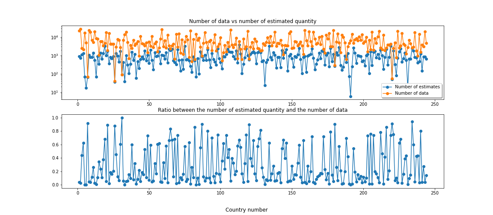

# Project of Data Visualization (COM-480)

| Student's name | SCIPER |
| -------------- | ------ |
|Maxime Dulon|302709|
|Francesca Paola Nicoletti |273034|
| Kieran Vaudaux| 287703|

[Milestone 1](#milestone-1) • [Milestone 2](#milestone-2) • [Milestone 3](#milestone-3)

## Milestone 1 (23rd April, 5pm)

**10% of the final grade**

This is a preliminary milestone to let you set up goals for your final project and assess the feasibility of your ideas.
Please, fill the following sections about your project.

*(max. 2000 characters per section)*

### Dataset

We have chosen to focus on the dataset, [Energy Statistics Database](http://data.un.org/Explorer.aspx), published by the United Nations Statistics Division on the UNData site. All data and metadata provided on UNdata website are available free of charge and may be copied freely, duplicated and further distributed provided that UNdata is cited as the reference. The Energy Statistics Database has 75 sub-datasets, each grouping information on specific energy fields, such as coal, biodiesel, fuel oil, geothermal, nuclear electricity, etc. It contains comprehensive energy statistics on more than 240 current countries or areas for production, trade, conversion and final consumption of primary and secondary; conventional and non-conventional; and new and renewable sources of energy. More precisely, for a certain energy statistic, these data provide:
* the name of the energy statistic,
* the country or the area from which it comes,
* the associated year,
* the quantity of that energy statistic,
* the unit in which it is expressed,
* a binary value that informs us whether that quantity is from an estimate or not.

The data has already been processed and cleaned, the only processing we will have to do on this data is to convert it to a format that suits us better as it is available in .xml format.  This dataset is provided with an [annual questionnaire on energy statistics](https://unstats.un.org/unsd/energystats/questionnaire/documents/Energy-Questionnaire-Guidelines.pdf), which provides detailed descriptions of each energy fields and statistics.

### Problematic

Energy is a very important topic nowadays so we thought this could be interesting to develop a visual representation of energy related data. We also want to give a global and complete vision of the world energy network.

What are the energy exchanges (production/consumption) between countries or even between continents?
Which types of energy are most present (produced/consumed), in which countries and the diversification over time?

In what areas are the different types of energy used? How does this evolve over time and how does it differ according to the wealth of the countries for example?
Are the most developed countries more advanced in the production of renewable energy?

How to improve and optimize the exchange of energy resources between countries?

We target audience in the following way: someone interested in knowing more about the energy network. The visualization must be adapted to an audience not educated on the subject.
The idea is to have the audience discover the subject in its globally first, then to have an interactive format to deepen some points.

The main point of our visualization is that it will show a global graphical overview of energy related quantities and one can find more information by interacting with the map to have more detailed knowledge about specific data.

### Exploratory Data Analysis

*Global Overview*

As mentioned in the presentation of the dataset, the Energy Statistics Database contains data on exactly 244 countries or areas spread over 75 subdatasets. In this first part of the Exploratory Data Analysis we will try to give an overview of the distribution of the data across each country and file, and we will also look at the number and distribution of data that have been estimated. For ease of use, we have chosen to refer to countries or areas with a number between 1 and 244 and to subdatasets with a number between 1 and 75, this allows us to have cleaner plots and is not at all problematic as we only want to provide a global overview of the data.

**Figure 1** - Plot of the number of dataset which contains data on a given country.

From __Figure 1__ we can see that half of the countries or areas are present in more than 50 subdatasets and that only a few countries or areas are present in less than 20 subdatasets. Furthermore, as each subdataset can be further divided into several sub-subdatasets by grouping it by energy statistic, such as exported quantity, imported quantity, final consumed quantity, etc.  This refinement in our subdatasets leads us to __Figure 2__ where we see that the median number of sub-subdatasets remains generally quite stable for each country or areas.

**Figure 2** - Plot of the median number of sub-subdatasets across each subdatasets for all country or areas.

From __Figure 1__ and __Figure 2__ we can therefore see that the data appears to be, on the whole, evenly distributed, which allows us to be relatively confident about the diversity of this dataset.

To complete this global analysis of the dataset, __Figure 3__ shows the number of available data per country or area in relation to the number of data that are estimates. The main figures from these plots are that only 65 countries or areas have a ratio between the number of data that are estimated and the number of data that are available that is higher than 50%, 106 have this ratio higher than 20% and 156 have this ratio higher than 10%. We therefore have that the proportion of data that have been estimated is globally quite high, but it remains relatively low (<10%) for almost a hundred countries. Taking this into consideration, we still plan to keep these estimated data, even if we will have to provide a way to manage them adequately in our visualisation.

**Figure 3** - Plot of the relation between the number of estimation data per country and the number of data per country.

  *Detailed analysis*

**Exports/Imports**

We took a quick look deeper in the fuel oil dataset to see what kind of data was present.

  

**Figure 4** - Plot of fuel oil exports and imports over years by summing each country's quantity.

On __Figure 4__ we see that the sum of exports and imports is not the same which implies that the difference is not 0 (__Figure 5__). This looked a bit strange to us and we have to be aware of this kind of mistakes as we did not find a correct explanation.

    

**Figure 5** - Plot of fuel oil difference between exports and imports over years by summing each country's quantity.

If we select only one country (e.g. Switzerland), we can visualize the exports and imports of this specific country over years (__Figure 6__).

    

**Figure 6** - Plot of fuel oil exports and imports over years for Switzerland.

    

**Figure 7** - Statistics of number of measures (corresponding to years) available by country.

We can see in __Figure 7__ that we have on average 25 measures for each country, which is really satisfying and will enable us to plot the data over years in our final visualization.

  **Production and Consumption**

The other main variables we wanted to look at are consumption and production.

To remain within the framework of Fuel Oil, __Figure 8__ shows us world total consumption and production of fuel oil across each subdatasets for all country or areas. The gap between the production and consumption curves seems quite surprising. It is assumed that this is because Fuel Oil can be extracted and stored, unlike other energy sources such as electricity which must be used immediately.

    

**Figure 8** - Plot of world total consumption and production of fuel oil across each subdatasets for all country or areas.

To confirm this, we have also analyzed world total consumption and production of electrivity across each subdatasets for all country or areas, which results are presented in __Figure 9__. The consumption and production curves here follow the same trend, they are very close to each other, so the assumption seems correct. Also, note that the production and consumption of electricity presents an increasing trend unlike that of Fuel Oil which decreases.

    

**Figure 9** - Plot of world total consumption and production of electrivity across each subdatasets for all country or areas.

This is interesting to note because it proves that it is relevant to carry out a visualization by highlighting the different types of energies because they do not have the same properties.

### Related work

The theme of energy is very broad and highly topical, particularly because of climate change and conflicts between energy-consuming and energy-producing countries.
However, the visualizations that exist today are often very specific to a topic, there are a lot of them but split into different web pages. It is therefore difficult to have a global vision / a big picture and interactive representation of the global energy network.

Here are some examples of existing websites containing a lot of split information on the global energy network:
* https://yearbook.enerdata.net/total-energy/world-energy-intensity-gdp-data.html
* https://ec.europa.eu/eurostat/fr/web/energy/visualisations
* https://ourworldindata.org/energy

What we would like to do is to intuitively show the main worldwide information not only by showing the most obvious information but also by choosing some other features than usual maps and many criteria. Also, we would like to allow to go through the data in more details thanks to filters if the reader is interested in those. We would like to permit the reader to sort the data from different points of view (as an example, chose a country and see which is its consumption/production and which type of energies it uses or either chose the type of energy and see in which countries is most produced/consumed). We extract the data from an official United Nations database so the information is complete and reliable, we want to give the possibility of viewing and sorting this information in an intuitive and visual way so that it is accessible to the greatest number of users and that the audience can learn about the subject.

We don't have a precise source of inspiration, but what we imagine is similar to visualizations already used in several fields, such as : a map of the world where the user can click on each country to have more detailed information on it, a slider to browse the different years, a color code/heat map to show which countries are the most producers/consumers of a certain type of energy, pie charts to show the distribution of domains in which a type of energy is used etc.

## Milestone 2 (7th May, 5pm)

### Visualization 2: Bubble chart race

**Figure 1** - Sketch of the bubble chart race visualization.

Through this visualization, we want to propose a way to visualize the evolution of an energy quantity (such as consumption, production, ... of a given energy) through time, while having an overall view on the different countries. For this purpose, we have chosen to create a bubble chart race, where each bubble corresponds to a country and the associated energy quantity is represented by the radius of each bubble. As we only have annual quantities, we will linearly interpolate these quantities in order to have an animation of the bubble chart race. To make our bubble chart race, we will need to take inspiration from the readings in week 5 (for the interactions), as well as some of the bubble chart and bar chart race implementations available on D3.js. In order not to overload our visualisation, we have also chosen not to specify the name or abbreviation of the name of each country within each bubble so as to display only the countries with the highest energy content. In addition, we will also display the 5 largest quantities and the associated countries in the top left corner of the visualisation (the number 5 is for the moment a bit arbitrary, it will depend on the most suitable layout we find). We are fully aware that not displaying the names of all the countries limits the information transmitted by our visualisation. To overcome this problem, we have several ideas that we will implement once the main part of this visualisation is implemented. Indeed, we will add an option to filter the countries that we want to appear in the bubble chart race, either by selecting the countries one by one, or by choosing the continents for which we want the countries to participate in the bubble chart race. Another option we will add will be to be able to highlight a country by moving the associated bubble away from the others and displaying the energy quantity associated with the selected country below. The last option we want to implement will be to propose to the user to choose an operation to apply to the energy quantity or to choose a second energy quantity to apply to both quantities. To illustrate this, we can imagine for example having a bubble chart race where the quantity of interest would be the difference between the production and consumption of a certain energy or a bubble chart race where the quantity of interest would be the inverse of the quantity of oil consumed, so as to highlight the countries that consume the least oil and not those that consume the most. This last option would have a lot of freedom and could lead to comparisons that would not make sense, such as looking at the difference between oil production and electricity exports from wind power, but this aspect would be up to the user, to whom we would leave the possibility of relating the data as he or she sees fit. For the choice of the colour scheme, we will mainly use the slides from week 6, each continent will have its own colour. In addition, to highlight the fact that certain quantities are estimated, we have chosen to display the associated bubbles in white in order to make this aspect of the data visual. If for a given country, the energy quantity of interest changes from an estimated value to an exact value, or vice versa, we will make a linear transition from white to the colour of the associated continent.

## Milestone 3 (4th June, 5pm)

**80% of the final grade**

## Late policy

- < 24h: 80% of the grade for the milestone
- < 48h: 70% of the grade for the milestone
